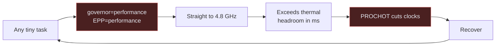
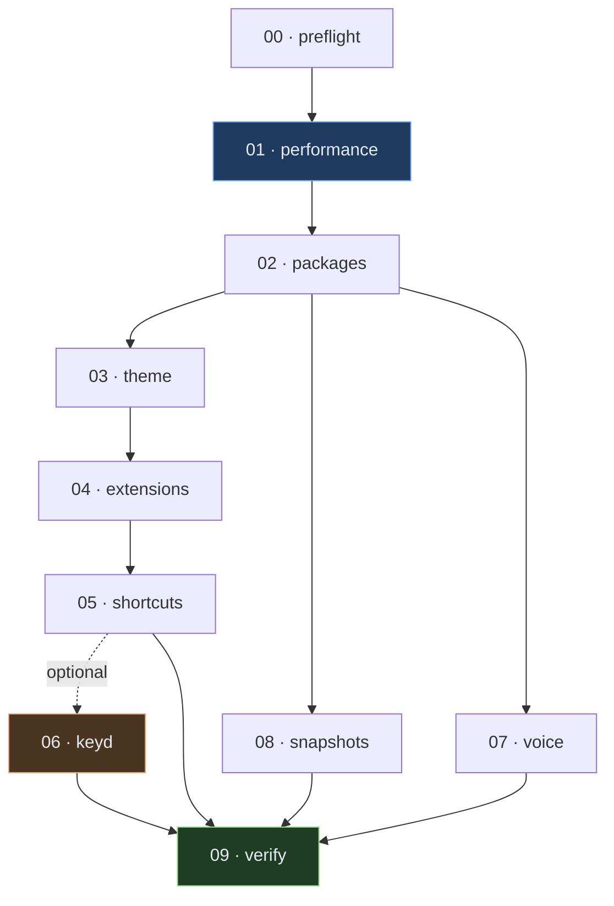
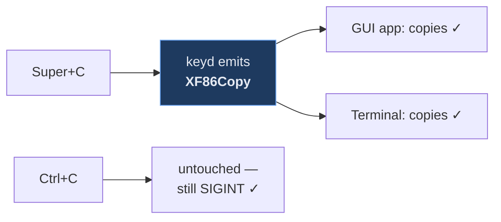

<div align="center">

# fedora-mac

**Make Fedora feel like macOS — and stop it thermal-throttling.**

Ten scripts for a Fedora GNOME/Wayland workstation: the macOS look and feel,
macOS-style shortcuts, a natural text-to-speech voice, and the performance fix
that mattered more than all the theming put together.

[**Site**](https://wosmos.github.io/fedora-mac) ·
[Architecture](docs/ARCHITECTURE.md) ·
[Shortcuts](docs/SHORTCUTS.md) ·
[Troubleshooting](docs/TROUBLESHOOTING.md) ·
[FAQ](docs/FAQ.md) ·
[Changelog](CHANGELOG.md)


</div>

---

> **Reference-tested.** Built and verified end-to-end on one machine: a Dell
> Latitude 5400 (i7-8665U, UHD 620, 16 GB, btrfs-on-LUKS) running Fedora 44 /
> GNOME Shell 50.1 / Wayland. The portability guards are written carefully but have
> not been exercised on other hardware. Run `00-preflight.sh` and `09-verify.sh`,
> and expect to fix a thing or two.

## Install

```bash
git clone https://github.com/Wosmos/fedora-mac ~/fedora-mac
cd ~/fedora-mac/scripts
bash install.sh            # everything except the Cmd-key layer
bash install.sh --keyd     # include it
```

Run as your **normal user** — it calls `sudo` where needed. Then log out and back in.

Check the result at any time:

```bash
bash scripts/09-verify.sh
```

---

## The part that actually mattered

This began as a theming project. It turned out the machine was being throttled by
its own CPU governor — a `performance` governor plus `energy_performance_preference=performance`
on a **15 W** laptop chip. It sprinted to maximum turbo for trivial work, exceeded
its thermal headroom in milliseconds, got cut by PROCHOT, and repeated.

| Measured at idle | Before | After |
|---|---|---|
| **Time spent thermally throttled** | **26–27% of wall clock** | **0%** |
| Package temperature | 82–89 °C | 51–61 °C |
| Fan | 3500 RPM | 0 RPM |
| CPU clock | 400 MHz **or** 4.2–4.8 GHz, nothing between | 400–1100 MHz, proper steps |

No hardware was changed to get this.



**If your machine feels laggy, check this before you blame anything else:**

```bash
cat /sys/devices/system/cpu/cpu0/thermal_throttle/package_throttle_total_time_ms
cat /sys/devices/system/cpu/cpu0/cpufreq/energy_performance_preference
```

Spot temperature readings lie. Sampling `sensors` every two seconds showed a
comfortable 61–68 °C while the CPU was throttling a quarter of the time — the
samples were landing in the valleys between millisecond spikes. Trust the
cumulative counters.

---

## What each script does



| Script | Privilege | What it does |
|---|---|---|
| `00-preflight.sh` | user | Backs up your entire dconf, prints a hardware and **thermal baseline**. Run first. |
| `01-performance.sh` | **sudo** | The important one. Removes forced-performance tuning, restores `power-profiles-daemon`, sane governor/EPP, zram swappiness, battery charge limit. |
| `02-packages.sh` | **sudo** | dnf speed config, RPM Fusion, full ffmpeg, hardware video decode, desktop tools, backup software. |
| `03-theme.sh` | user | WhiteSur GTK/shell/icons/cursors, Inter + JetBrains Mono, wallpaper, macOS system sounds. |
| `04-extensions.sh` | user | 12 GNOME extensions from extensions.gnome.org, configured for a weak iGPU. |
| `05-shortcuts.sh` | user | macOS-style keybindings using GNOME settings alone. |
| `06-keyd.sh` | **sudo** | *Optional.* Super-as-Cmd in every application. Most invasive step. |
| `07-voice-sounds.sh` | user | Piper neural TTS replacing robotic espeak-ng. |
| `08-snapshots.sh` | **sudo** | btrfs snapshots via snapper, wired into dnf. |
| `09-verify.sh` | user | Read-only end-to-end check. |

---

## The one genuinely clever bit

Making `Cmd+C` work on Linux normally breaks terminals: remappers send `Ctrl+C`,
which is SIGINT. You lose either copy or interrupt.

keyd instead emits the **`XF86Copy` / `XF86Paste` / `XF86Cut` media keys**. GTK and
Qt handle those natively as clipboard actions, and since `Ctrl+C` is never
transmitted, interrupt keeps working untouched.



Full explanation in [ARCHITECTURE.md](docs/ARCHITECTURE.md#the-clipboard-problem).

---

## Shortcuts

A few highlights — the full reference is in [SHORTCUTS.md](docs/SHORTCUTS.md).

| Key | Action |
|---|---|
| <kbd>Shift</kbd>+<kbd>Super</kbd>+<kbd>3</kbd>/<kbd>4</kbd>/<kbd>5</kbd> | Screenshots |
| <kbd>Ctrl</kbd>+<kbd>↑</kbd> | Mission Control |
| <kbd>Super</kbd>+<kbd>Space</kbd> | Spotlight |
| <kbd>Ctrl</kbd>+<kbd>←</kbd>/<kbd>→</kbd> | Switch Spaces |
| <kbd>Ctrl</kbd>+<kbd>Alt</kbd>+<kbd>V</kbd> | Clipboard history |
| <kbd>Super</kbd>+<kbd>C</kbd>/<kbd>V</kbd>/<kbd>X</kbd> | Copy/paste/cut everywhere *(keyd)* |
| <kbd>Backspace</kbd>+<kbd>Esc</kbd>+<kbd>Enter</kbd> | **Panic key — kills keyd** |

---

## Portability

`lib/common.sh` holds shared guards. Scripts refuse to run on a non-Fedora or
non-GNOME system, warn on X11, check commands and network before downloading, and
adapt rather than assuming the reference hardware:

- no battery (desktop) → charge-limit step skipped
- no zram → swappiness left alone, because 150 is only correct for *compressed* swap
- no btrfs → snapshot script exits cleanly
- AMD instead of Intel → warns, applies governor settings anyway
- a terminal other than Ptyxis → says so instead of silently doing nothing

No usernames or absolute home paths are baked in; everything resolves the invoking
user even under `sudo`.

---

## Hard-won gotchas

Each cost real debugging time. Full detail in
[TROUBLESHOOTING.md](docs/TROUBLESHOOTING.md).

1. **"Enabled" is not "running."** A GNOME extension can sit in the enabled list
   reporting `OUT OF DATE` and silently never load. Check `State`.
2. **keyd compound layers inherit, they do not pass through.** Omitting a key from
   `[meta+shift]` makes it fall back to `[meta]` and fire the wrong thing.
3. **Never grep keyd's output for "error."** Its success message is *"No errors found."*
4. **Spot temperatures lie.** Trust the cumulative throttle counters.
5. **The `piper` RPM in Fedora's repos is a gaming-mouse tool**, not the TTS engine.
6. **Never run `pkill -f speech-dispatcher`** — the pattern matches the calling
   shell's own command line and kills your session.
7. **A stale WhiteSur clone silently half-breaks the shell theme.**
8. **Fractional scaling is expensive on integrated graphics.**
9. **keyd's COPRs are unreliable.** Build from source.

---

## What this deliberately does not do

- **TPM2 LUKS auto-unlock.** Would cut ~18 s off boot, but a mistake locks you out
  of your own disk. Do it by hand, with your passphrase written down first.
- **Ship Apple's assets.** Siri voices and macOS sounds are proprietary. This uses
  Piper neural voices and a community sound theme instead.

---

## Reverting

```bash
# GNOME settings (backup made by 00-preflight.sh)
dconf load /org/gnome/ < ~/.config/fedora-macos-setup-backup-*/dconf-gnome.ini

# Login screen theme
sudo ~/Downloads/whitesur/WhiteSur-gtk-theme/tweaks.sh -r
sudo dnf reinstall -y gnome-shell          # nuclear option

# keyd
sudo systemctl disable --now keyd
gsettings set org.gnome.Ptyxis.Shortcuts copy-clipboard  '<Control><Shift>c'
gsettings set org.gnome.Ptyxis.Shortcuts paste-clipboard '<Control><Shift>v'
```

If the login screen ever breaks, <kbd>Ctrl</kbd>+<kbd>Alt</kbd>+<kbd>F3</kbd> gets
you a text console.

---

## Hardware notes

Software only goes so far on an older laptop:

- **Thermal paste and dust** usually matter more than any software tuning on a
  machine over a few years old.
- **Battery health** — check `capacity:` in `upower -i $(upower -e | grep BAT)`.
  Below ~50% of design, replace it.
- **Firmware** — `fwupdmgr get-updates`. The reference machine was 3.5 years behind.
- **RAM** — check `/proc/pressure/memory` first. If `avg300` is `0.00` and swap is
  unused, more RAM will do nothing. On the reference machine that counter read
  *seven microseconds* of stall since boot.

---

## Related

**[furnizsh](https://github.com/Wosmos/furnizsh)** — the terminal half of the same
setup. Fit out Ghostty, zsh and Starship in one command, with four matched themes
and 24 helper commands. This repo assumes a terminal exists but doesn't require
furnizsh specifically.

---

## Analytics

Two separate things, because they measure different audiences.

**Repo traffic** is built into GitHub — views, clones, referrers and popular
paths, no script required. Its catch is a **14-day window**, after which the data
is gone. `.github/workflows/traffic.yml` snapshots it weekly into
`docs/traffic/` so the history survives.

```bash
gh api repos/Wosmos/fedora-mac/traffic/views
gh api repos/Wosmos/fedora-mac/traffic/popular/referrers
```

**Site traffic** GitHub does not provide at all — Pages is static hosting with no
log access, and the Pages API exposes no visitor statistics of any kind. A
client-side script is the only option, so the site uses
[GoatCounter](https://www.goatcounter.com): no cookies, no cross-site tracking,
no consent banner. It is **off by default** — nothing loads until a site code is
set in `site/index.html`, and it skips itself on localhost.

Its one real limitation is that any client-side counter misses visitors with
JavaScript off or an ad blocker active — typically 5–15%. The only way to catch
those is server-side logging, which needs a custom domain proxied through
Cloudflare, or moving off GitHub Pages entirely. Not worth it for a project
like this.

GitHub Pages was kept rather than moving to Vercel or Cloudflare, since hosting
lives next to the repo and a static page gains nothing from a second deploy
target. `vercel.json` is committed anyway, with security headers and asset
caching, if you ever want `vercel --prod`.

## Contributing

Issues and PRs welcome — see [CONTRIBUTING.md](CONTRIBUTING.md). The short version:
everything must be idempotent, reversible, and must not assume the reference
hardware. Say which Fedora and GNOME version you tested on.

See also [CODE_OF_CONDUCT.md](CODE_OF_CONDUCT.md) and [SECURITY.md](SECURITY.md) —
the latter is worth reading before you run any of this, since it installs a
kernel-level key remapper and replaces a system file the login screen depends on.

## Licence

[MIT](LICENSE) © Muhammad Wasif Malik

Built with the help of theme and tool authors credited throughout the scripts —
notably [vinceliuice](https://github.com/vinceliuice) (WhiteSur),
[rvaiya](https://github.com/rvaiya) (keyd), and the
[Piper](https://github.com/OHF-Voice/piper1-gpl) and
[Rhasspy](https://huggingface.co/rhasspy/piper-voices) projects.
