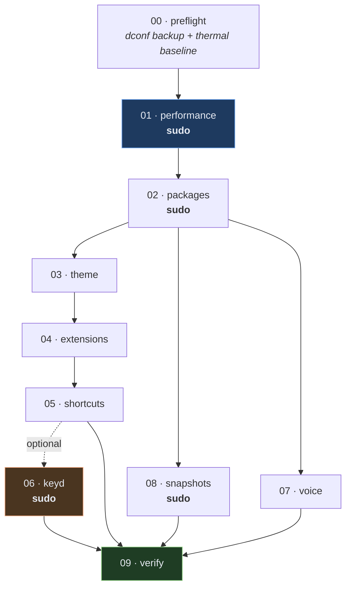
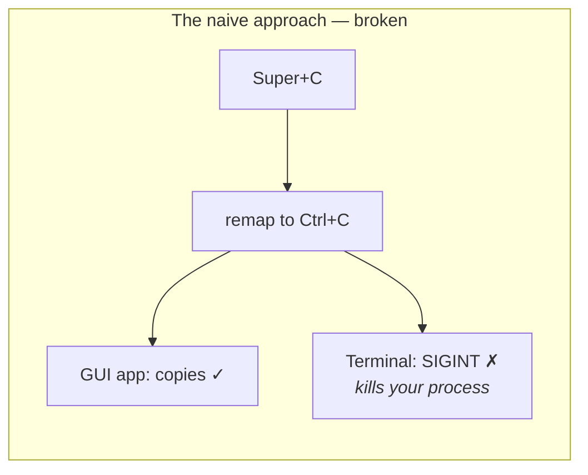
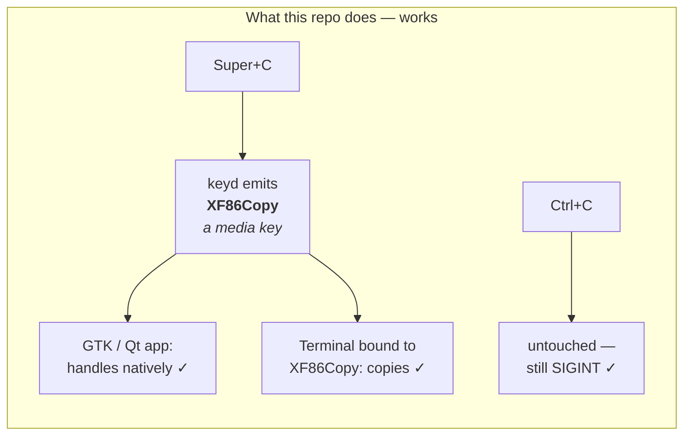
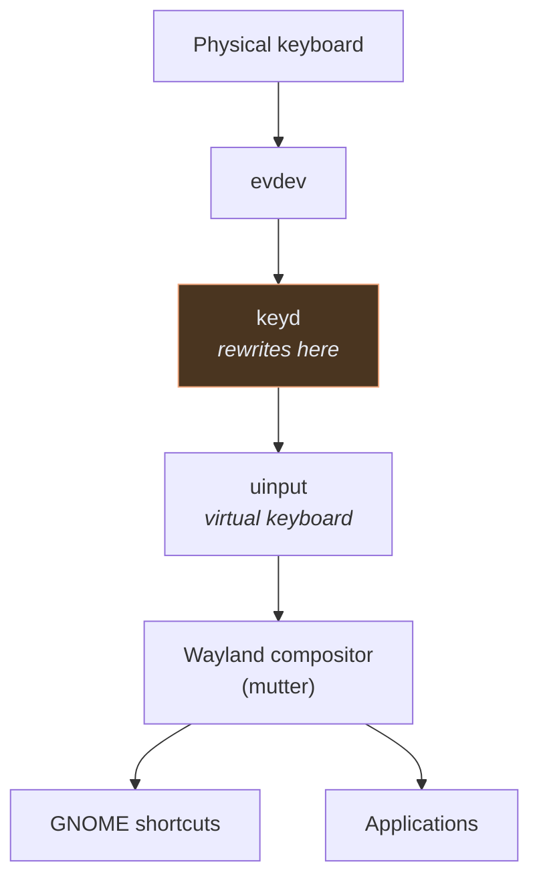
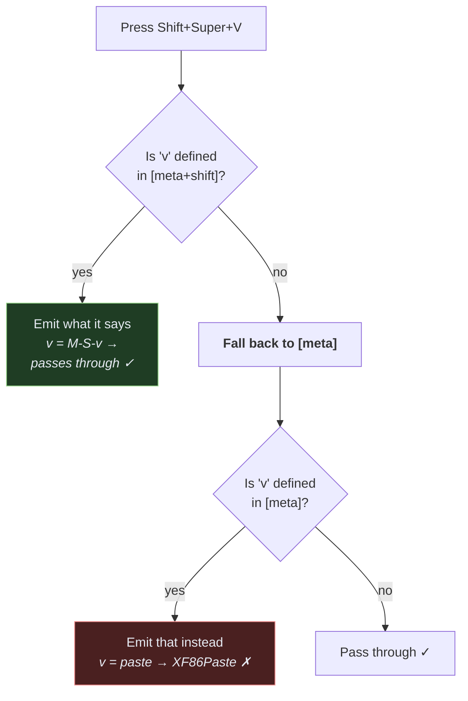
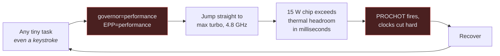

# Architecture

How the pieces fit, and why they are arranged this way.

---

## Run order

Order matters more than it looks. Packages must exist before the theme can be
built, the theme must be in place before extensions reference it, and keyd must be
confirmed running before the terminal is pointed at the media keys it emits.



**01 is highlighted** because it is the only script whose absence you will actually
feel. **06 is amber** because it is the most invasive. **09 is green** because it is
read-only and safe to run at any point.

---

## The clipboard problem

This is the one genuinely non-obvious piece of engineering in the repo.

Making `Cmd+C` work on Linux normally means remapping `Super+C` → `Ctrl+C`. In a
terminal that is a disaster: `Ctrl+C` is SIGINT. You end up choosing between copy
and interrupt.

The way out is to never send `Ctrl+C` at all.





Because `Ctrl+C` is never transmitted, interrupt keeps working. The terminal is then
told to listen for the media key instead of `Ctrl+Shift+C`:

```bash
gsettings set org.gnome.Ptyxis.Shortcuts copy-clipboard  'XF86Copy'
gsettings set org.gnome.Ptyxis.Shortcuts paste-clipboard 'XF86Paste'
```

> **Ordering trap.** That setting is a single string, not a list — it *replaces*
> `Ctrl+Shift+C` rather than adding to it. Applying it before keyd is running leaves
> the terminal with no working copy/paste at all. `06-keyd.sh` therefore only makes
> this change after `systemctl is-active keyd` succeeds.

---

## Where keyd sits

keyd works at the evdev level, below the display server. That is why it works on
Wayland, where X11-era tools like `xmodmap` do not.



Two consequences follow, and both caused real bugs here:

1. **GNOME never sees what keyd consumed.** Any `Super+<key>` that keyd maps is gone
   before mutter gets it. That is why window tiling moved to `Ctrl+Super+arrows` —
   `Super+arrows` became macOS text navigation.

2. **Combinations keyd doesn't define pass straight through.** `Ctrl+Alt+V` never
   enters a keyd layer, so it is a reliable fallback when a `Super` binding misbehaves.
   The clipboard manager is bound to both for exactly this reason.

### Layer inheritance

The subtlest trap in the whole repo:



Omission means **inherit**, not **pass through**. To genuinely let a key reach the
compositor, re-emit it explicitly.

---

## Why the thermal fix works

The failure was a feedback loop, not a single bad setting.



Measured: **24,440 throttle events** and **27% of wall-clock time throttled** while
the machine was doing nothing.

The fix breaks the loop at the top. With `EPP=balance_performance` the chip uses its
intermediate P-states — light work is serviced at 700–1100 MHz instead of 4.8 GHz, so
it never reaches the ceiling and never gets cut.

Frequency distribution, same machine, same idle conditions:

| | Before | After |
|---|---|---|
| Samples at minimum (400 MHz) | ~half | ~half |
| Samples at max turbo (4.2–4.8 GHz) | ~half | **none** |
| Samples in between | **1 of 96** | most |

The absence of a middle gear is the signature. If you see it, that is your problem.

---

## Layout

```
lib/common.sh          guards, hardware detection, helpers
                       everything else sources this

scripts/00 … 09        numbered, ordered, independently runnable
scripts/install.sh     orchestrator — runs them with the right privileges

conf/                  templatised configs (keyd, piper)
                       __PIPER__ / __VOICES__ substituted at install time

docs/                  this file, TROUBLESHOOTING, SHORTCUTS, FAQ
site/                  GitHub Pages landing page
```

### Privilege split

Root-level work and user-level work are deliberately in separate scripts rather than
sprinkled through one, so you can read exactly what runs as root:

| Root | User |
|---|---|
| 01 performance, 02 packages, 06 keyd, 08 snapshots | 00 preflight, 03 theme, 04 extensions, 05 shortcuts, 07 voice, 09 verify |

Where a root script must touch user settings, it goes through `as_user` in
`lib/common.sh`, which resolves the invoking human rather than writing into root's
own dconf.
